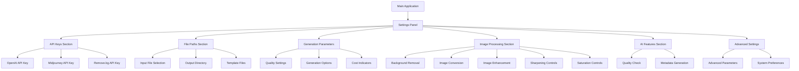
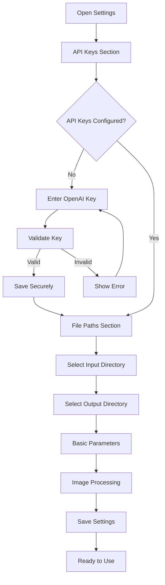
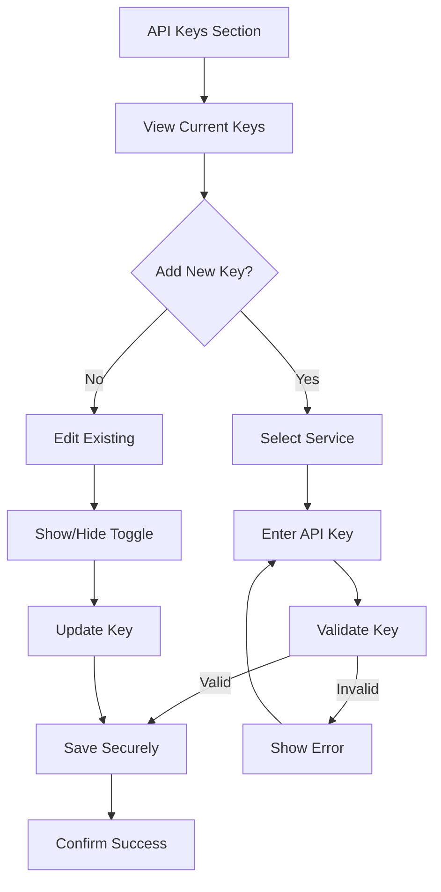
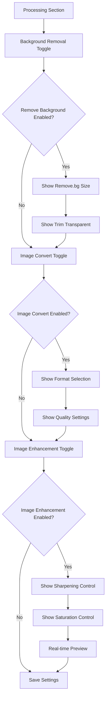
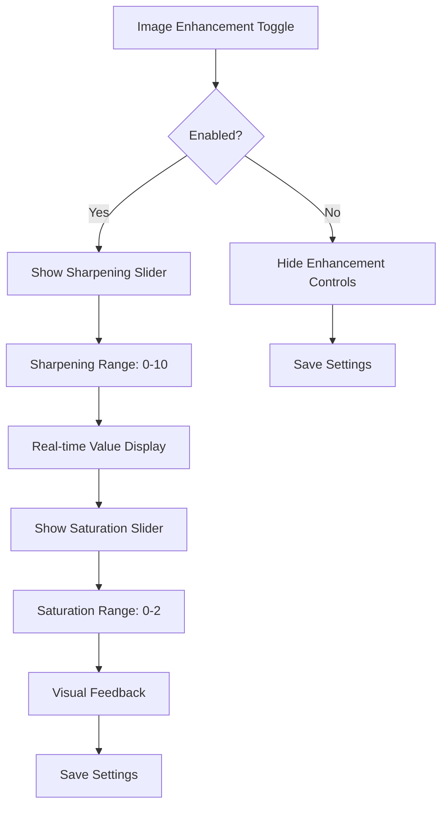
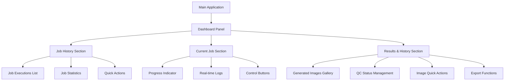
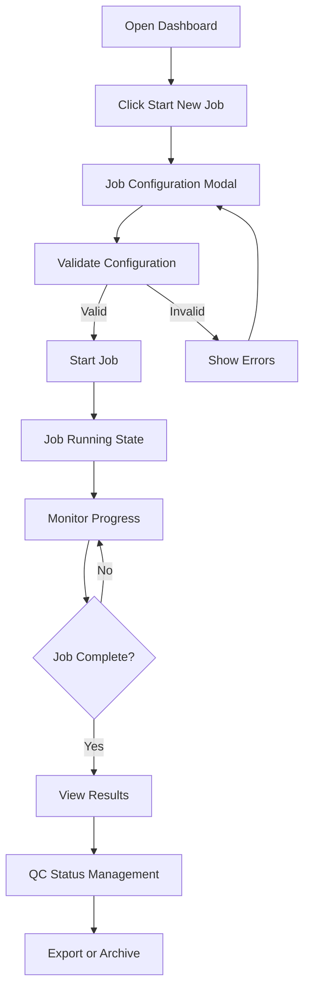
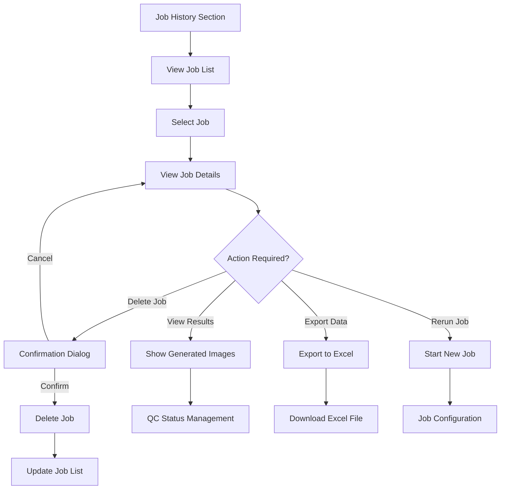
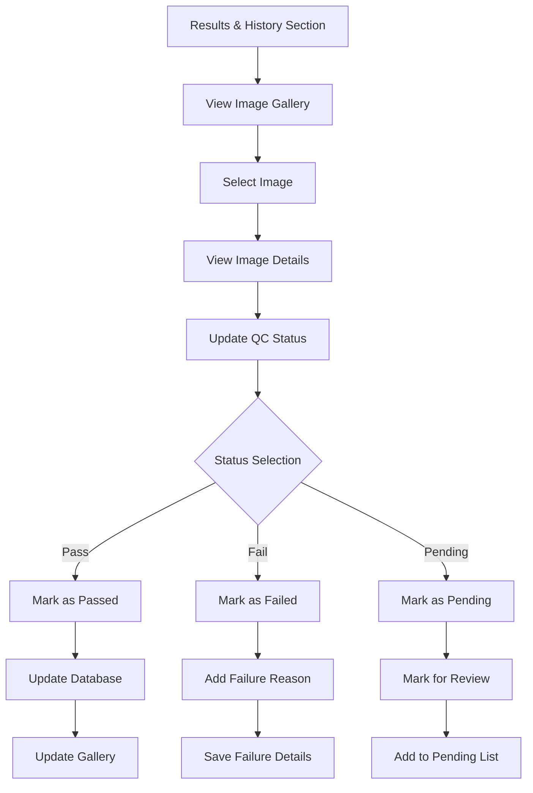
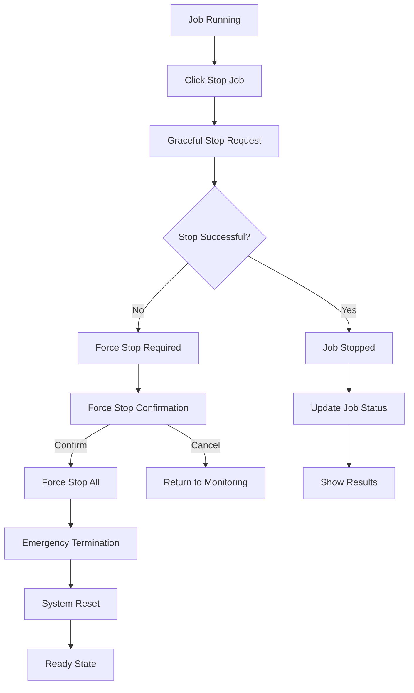

# Gen Image Factory - Application Settings UI Specification

## Introduction

This document defines the user experience goals, information architecture, user flows, and visual design specifications for the Application Settings UI in Gen Image Factory - an Electron desktop application. The settings page serves as the central configuration hub for managing API keys, file paths, and generation parameters through an intuitive graphical interface that leverages native desktop capabilities.

## UX Goals & Principles

### Target User Personas
- **Power User:** Technical professionals who need advanced configuration options and efficiency
- **Casual User:** Users who prioritize ease of use and clear guidance for basic settings
- **Administrator:** System managers who need secure API key management and oversight

### Usability Goals
- **Ease of learning:** New users can configure basic settings within 3 minutes
- **Efficiency of use:** Power users can access advanced settings with minimal navigation
- **Error prevention:** Clear validation and confirmation for destructive actions
- **Security awareness:** Users understand which settings affect API costs and security

### Design Principles
1. **Clarity over cleverness** - Prioritize clear communication over aesthetic innovation
2. **Progressive disclosure** - Show basic settings first, advanced options on demand
3. **Consistent patterns** - Use familiar desktop UI patterns throughout the application
4. **Immediate feedback** - Every action should have a clear, immediate response
5. **Secure by default** - Sensitive data (API keys) should be handled securely using native OS credential managers
6. **Native desktop integration** - Leverage OS file dialogs, system notifications, and native security features
7. **Conditional visibility** - Show only relevant options based on user selections to reduce complexity
8. **Master toggle system** - Implement logical feature dependencies to prevent user confusion
9. **Independent features** - Allow flexible feature combinations while maintaining logical relationships

## Information Architecture

### Site Map

### Navigation Structure
- **Primary Navigation:** Settings tab in main application navigation
- **Secondary Navigation:** Section tabs within settings (API Keys, Files, Parameters, Processing, AI, Advanced)
- **Breadcrumb Strategy:** Settings > [Current Section]

## User Flows

### Flow 1: Initial Settings Configuration
**User Goal:** Set up application for first use
**Entry Points:** First-time app launch, Settings tab
**Success Criteria:** All required API keys configured, basic file paths set

**Flow Diagram:**

**Edge Cases & Error Handling:**
- Invalid API key format
- Network connectivity issues during key validation
- File permission errors for directory selection
- Secure storage unavailable on system

### Flow 2: API Key Management
**User Goal:** Securely manage API keys for different services
**Entry Points:** Settings > API Keys section
**Success Criteria:** Keys stored securely, validation successful

**Flow Diagram:**

### Flow 3: Image Processing Configuration
**User Goal:** Configure image processing options with enhanced controls
**Entry Points:** Settings > Processing section
**Success Criteria:** Image processing settings configured with proper dependencies

**Flow Diagram:**

### Flow 4: Enhanced Image Processing
**User Goal:** Configure image enhancement with precise controls
**Entry Points:** Settings > Processing > Image Enhancement
**Success Criteria:** Sharpening and saturation configured with visual feedback

**Flow Diagram:**

## Visual Design Specifications

### Color Palette
- **Primary Blue:** #3B82F6 (Blue-500) - Main actions, links
- **Success Green:** #10B981 (Emerald-500) - Success states, validations
- **Warning Orange:** #F59E0B (Amber-500) - Warnings, cost indicators
- **Error Red:** #EF4444 (Red-500) - Errors, destructive actions
- **Neutral Gray:** #6B7280 (Gray-500) - Secondary text, borders
- **Background:** #F9FAFB (Gray-50) - Page background
- **Surface:** #FFFFFF (White) - Card backgrounds

### Typography
- **Primary Font:** System default (San Francisco on macOS, Segoe UI on Windows)
- **Heading Sizes:** 
  - H1: 24px, font-weight: 600
  - H2: 20px, font-weight: 600
  - H3: 18px, font-weight: 500
- **Body Text:** 14px, line-height: 1.5
- **Caption Text:** 12px, color: Gray-500

### Component Specifications

#### **Toggle Switches**
- **Size:** 44px width, 24px height
- **Track Color:** Gray-200 (inactive), Blue-500 (active)
- **Thumb Color:** White with shadow
- **Animation:** Smooth 0.2s transition
- **Accessibility:** ARIA labels, keyboard navigation

#### **Range Sliders**
- **Track Height:** 8px
- **Thumb Size:** 20px diameter
- **Track Color:** Gray-200
- **Active Color:** Blue-500
- **Visual Feedback:** Real-time value display
- **Step Increments:** 0.5 for sharpening, 0.1 for saturation

#### **Form Inputs**
- **Height:** 40px
- **Border:** 1px Gray-300
- **Focus State:** 2px Blue-500 ring
- **Error State:** 1px Red-500 border
- **Padding:** 12px horizontal, 8px vertical

#### **Cost Indicators**
- **Free:** Green badge with checkmark icon
- **Low Cost:** Blue badge with dollar icon
- **Medium Cost:** Orange badge with warning icon
- **High Cost:** Red badge with alert icon

### Layout Specifications

#### **Settings Panel Layout**
- **Width:** 800px maximum
- **Padding:** 24px on all sides
- **Section Spacing:** 32px between sections
- **Card Background:** White with subtle shadow
- **Border Radius:** 8px for cards, 6px for inputs

#### **Responsive Design**
- **Desktop:** Full layout with sidebar navigation
- **Tablet:** Stacked layout with tab navigation
- **Mobile:** Single column with accordion sections

### Accessibility Compliance

#### **WCAG 2.1 AA Standards**
- **Color Contrast:** Minimum 4.5:1 for normal text, 3:1 for large text
- **Keyboard Navigation:** Full keyboard accessibility
- **Screen Reader Support:** Proper ARIA labels and descriptions
- **Focus Management:** Clear focus indicators and logical tab order
- **Error Handling:** Clear error messages and validation feedback

#### **Keyboard Shortcuts**
- **Tab:** Navigate between form elements
- **Space/Enter:** Activate buttons and toggles
- **Arrow Keys:** Adjust range sliders
- **Escape:** Close dialogs and cancel actions

### Interactive Elements

#### **Range Slider Behavior**
- **Mouse:** Click and drag for precise control
- **Keyboard:** Arrow keys for step-by-step adjustment
- **Touch:** Swipe gestures for mobile devices
- **Visual Feedback:** Real-time value display and range indicators

#### **Toggle Switch Behavior**
- **Click:** Toggle between on/off states
- **Keyboard:** Space/Enter to toggle
- **Visual Feedback:** Smooth animation with color change
- **State Persistence:** Maintains state across sessions

#### **Conditional Visibility**
- **Smooth Transitions:** 0.3s fade in/out animations
- **Logical Grouping:** Related controls appear together
- **Progressive Disclosure:** Advanced options shown on demand
- **Context Awareness:** Only relevant options visible

## Implementation Guidelines

### Component Architecture
- **React Components:** TypeScript with proper prop interfaces
- **State Management:** Centralized settings state with change tracking
- **Form Validation:** Real-time validation with error display
- **Error Handling:** Graceful error handling with user-friendly messages

### Performance Considerations
- **Lazy Loading:** Load sections on demand
- **Debounced Input:** Prevent excessive API calls during typing
- **Optimized Rendering:** Use React.memo for expensive components
- **Efficient State Updates:** Minimize re-renders with proper state management

### Security Implementation
- **Secure Storage:** Use keytar for API key storage
- **Input Validation:** Validate all user inputs
- **Error Sanitization:** Don't expose sensitive information in errors
- **Access Control:** Implement proper permission checks

### Testing Strategy
- **Unit Tests:** Test individual components in isolation
- **Integration Tests:** Test component interactions
- **E2E Tests:** Test complete user workflows
- **Accessibility Tests:** Verify WCAG compliance
- **Cross-platform Tests:** Test on Windows, macOS, and Linux

---

# Gen Image Factory - Dashboard UI Specification

## Introduction

This document defines the user experience goals, information architecture, user flows, and visual design specifications for the Dashboard UI in Gen Image Factory - an Electron desktop application. The dashboard serves as the main control center for job execution, progress monitoring, and results management through an intuitive graphical interface that provides real-time feedback and comprehensive job management capabilities.

## UX Goals & Principles

### Target User Personas
- **Job Operator:** Users who need to start, monitor, and manage image generation jobs
- **Quality Controller:** Users who review and approve generated images with QC status management
- **Data Analyst:** Users who need to export results and analyze job statistics
- **System Administrator:** Users who need to manage job history and system resources

### Usability Goals
- **Ease of operation:** Users can start and monitor jobs within 30 seconds
- **Real-time awareness:** Users always know the current job status and progress
- **Error recovery:** Clear error messages and recovery options for failed jobs
- **Data management:** Easy access to job history, results, and export capabilities

### Design Principles
1. **Single job focus** - Only one job can run at a time, UI clearly communicates this constraint
2. **Real-time feedback** - Immediate visual feedback for all job operations
3. **Progressive disclosure** - Show essential information first, details on demand
4. **Action-oriented** - Primary actions (start, stop) are prominent and accessible
5. **Data-driven** - All displays are based on real backend data and statistics
6. **Error prevention** - Confirmation dialogs for destructive actions
7. **Accessibility first** - Full keyboard navigation and screen reader support
8. **Responsive design** - Works across different screen sizes and orientations

## Information Architecture

### Site Map

### Navigation Structure
- **Primary Navigation:** Dashboard tab in main application navigation
- **Secondary Navigation:** Job history, current job, results sections
- **Breadcrumb Strategy:** Dashboard > [Current Section]

## User Flows

### Flow 1: Job Execution Workflow
**User Goal:** Start and monitor an image generation job
**Entry Points:** Dashboard tab, "Start New Job" button
**Success Criteria:** Job starts successfully, progress is visible, results are accessible

**Flow Diagram:**

**Edge Cases & Error Handling:**
- Job already running (single job constraint)
- Configuration validation errors
- Network connectivity issues during job execution
- Job failure with error recovery options

### Flow 2: Job History Management
**User Goal:** View and manage completed job history
**Entry Points:** Dashboard > Job History section
**Success Criteria:** Job history is accessible, quick actions work, data is accurate

**Flow Diagram:**

### Flow 3: Image Quality Control
**User Goal:** Review and manage generated image quality
**Entry Points:** Dashboard > Results & History section
**Success Criteria:** QC status is updated, images are properly categorized

**Flow Diagram:**

### Flow 4: Emergency Job Control
**User Goal:** Stop a running job in emergency situations
**Entry Points:** Dashboard > Current Job section
**Success Criteria:** Job stops safely, system returns to ready state

**Flow Diagram:**

## Visual Design Specifications

### Color Palette (Consistent with Settings UI)
- **Primary Blue:** #3B82F6 (Blue-500) - Main actions, links
- **Success Green:** #10B981 (Emerald-500) - Success states, validations
- **Warning Orange:** #F59E0B (Amber-500) - Warnings, cost indicators
- **Error Red:** #EF4444 (Red-500) - Errors, destructive actions
- **Neutral Gray:** #6B7280 (Gray-500) - Secondary text, borders
- **Background:** #F9FAFB (Gray-50) - Page background
- **Surface:** #FFFFFF (White) - Card backgrounds

### Typography (Consistent with Settings UI)
- **Primary Font:** System default (San Francisco on macOS, Segoe UI on Windows)
- **Heading Sizes:** 
  - H1: 24px, font-weight: 600
  - H2: 20px, font-weight: 600
  - H3: 18px, font-weight: 500
- **Body Text:** 14px, line-height: 1.5
- **Caption Text:** 12px, color: Gray-500

### Component Specifications

#### **Dashboard Layout**
- **Width:** 800px maximum (consistent with Settings UI)
- **Padding:** 24px on all sides
- **Section Spacing:** 32px between sections
- **Card Background:** White with subtle shadow
- **Border Radius:** 8px for cards, 6px for inputs

#### **Job Control Buttons**
- **Start Job Button:** Large primary blue button (48px height), disabled when job running
- **Stop Job Button:** Secondary red button, only enabled when job is running
- **Force Stop Button:** Emergency red button with confirmation dialog
- **Button States:** Loading states, disabled states, hover effects

#### **Progress Indicators**
- **Circular Progress:** 120px diameter, animated progress ring
- **Step Timeline:** Horizontal timeline with step indicators
- **Progress Text:** Real-time percentage and step name
- **Time Remaining:** Estimated completion time display

#### **Job History Cards**
- **Card Size:** 300px width, auto height
- **Status Badges:** Color-coded badges (green=completed, blue=running, red=failed, gray=stopped)
- **Quick Actions:** Small action buttons (view, export, delete, rerun)
- **Hover Effects:** Subtle elevation and action button visibility

#### **Image Gallery**
- **Grid Layout:** Responsive grid with 200px thumbnail size
- **QC Status Indicators:** Color-coded borders (green=pass, red=fail, yellow=pending)
- **Image Actions:** Context menu with QC status update, delete, metadata view
- **Loading States:** Skeleton loaders for image loading

### Layout Specifications

#### **Dashboard Panel Layout**
- **Header Section:** Job controls and status indicators
- **Main Content:** Two-column layout (40% job history, 60% current job)
- **Bottom Section:** Full-width results and history view
- **Responsive Breakpoints:** Stack layout on smaller screens

#### **Responsive Design**
- **Desktop:** Full two-column layout with sidebar
- **Tablet:** Stacked layout with tab navigation
- **Mobile:** Single column with accordion sections

### Accessibility Compliance

#### **WCAG 2.1 AA Standards**
- **Color Contrast:** Minimum 4.5:1 for normal text, 3:1 for large text
- **Keyboard Navigation:** Full keyboard accessibility for all controls
- **Screen Reader Support:** Proper ARIA labels and descriptions
- **Focus Management:** Clear focus indicators and logical tab order
- **Error Handling:** Clear error messages and validation feedback

#### **Keyboard Shortcuts**
- **Tab:** Navigate between dashboard sections
- **Space/Enter:** Activate buttons and controls
- **Arrow Keys:** Navigate job history and image gallery
- **Escape:** Close modals and cancel actions
- **Ctrl+S:** Quick save/export functionality

### Interactive Elements

#### **Job Control Behavior**
- **Start Job:** Opens configuration modal, validates settings, starts job
- **Stop Job:** Graceful shutdown with progress indication
- **Force Stop:** Emergency termination with confirmation dialog
- **Real-time Updates:** Live progress updates via IPC events

#### **Job History Interaction**
- **Job Selection:** Click to view details, right-click for context menu
- **Quick Actions:** Hover to reveal action buttons
- **Export Function:** Downloads Excel file with job results
- **Delete Confirmation:** Shows job details before deletion

#### **Image Gallery Interaction**
- **Image Selection:** Click to view full size, right-click for actions
- **QC Status Update:** Dropdown with pass/fail/pending options
- **Metadata View:** Modal with detailed image information
- **Bulk Actions:** Select multiple images for batch operations

## Implementation Guidelines

### Component Architecture
- **React Components:** TypeScript with proper prop interfaces
- **State Management:** Centralized dashboard state with real-time updates
- **Backend Integration:** All actions connect to real backend methods
- **Error Handling:** Comprehensive error handling with user-friendly messages

### Performance Considerations
- **Real-time Updates:** Efficient polling and event-based updates
- **Image Loading:** Lazy loading for image gallery
- **Data Caching:** Cache job history and statistics
- **Optimized Rendering:** Use React.memo for expensive components

### Backend Integration
- **Job Control:** `job:start`, `job:stop`, `job:force-stop`
- **Job History:** `job-execution:get-all`, `job-execution:history`
- **Job Statistics:** `job-execution:statistics`
- **Image Management:** `generated-image:get-all`, `generated-image:update-qc-status`
- **Quick Actions:** `deleteJobExecution`, `exportToExcel`, `manualApproveImage`

### Security Implementation
- **Action Confirmation:** Confirmation dialogs for destructive actions
- **Error Sanitization:** Don't expose sensitive information in errors
- **Access Control:** Proper permission checks for all operations
- **Data Validation:** Validate all user inputs and backend responses

### Testing Strategy
- **Unit Tests:** Test individual dashboard components
- **Integration Tests:** Test backend integration and IPC communication
- **E2E Tests:** Test complete job execution workflows
- **Accessibility Tests:** Verify WCAG compliance
- **Performance Tests:** Test real-time updates and large data sets

## Real Backend Integration Points

### Job Control Methods
- **`job:start`** - Start new job with configuration
- **`job:stop`** - Graceful job shutdown
- **`job:force-stop`** - Emergency process termination

### Job History Methods
- **`job-execution:get-all`** - Get all job executions
- **`job-execution:history`** - Get limited job history
- **`job-execution:statistics`** - Get job statistics
- **`job-execution:delete`** - Delete job execution

### Image Management Methods
- **`generated-image:get-all`** - Get all generated images
- **`generated-image:get-by-execution`** - Get images by job execution
- **`generated-image:update-qc-status`** - Update image QC status
- **`generated-image:delete`** - Delete generated image

### Quick Actions Methods
- **`deleteJobExecution`** - Delete job and associated images
- **`exportToExcel`** - Export job results to Excel
- **`manualApproveImage`** - Manual approval for failed images
- **`getJobResults`** - Get detailed job results

### Real-time Updates
- **Progress Events:** Live progress updates via IPC
- **Log Streaming:** Real-time log updates
- **Status Changes:** Job status updates
- **Error Events:** Error notifications and handling 