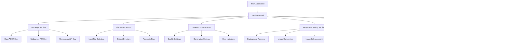
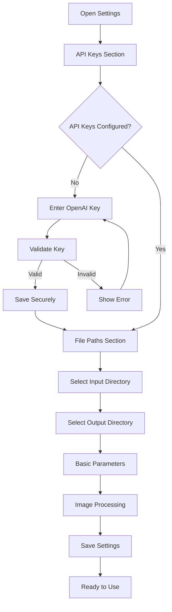
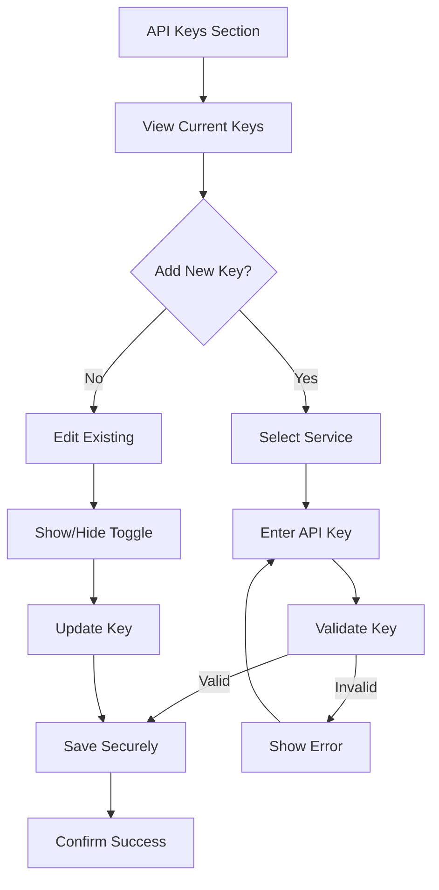
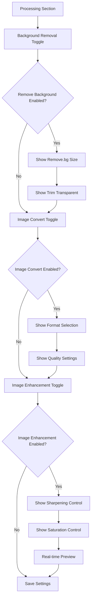
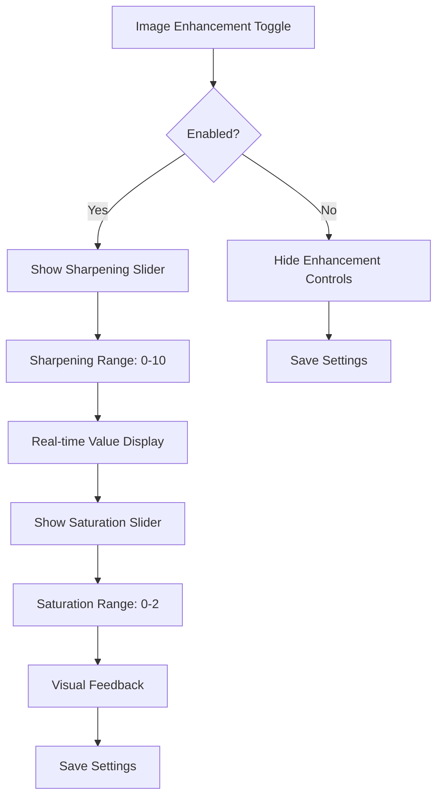

# Gen Image Factory - Application Settings UI Specification

## Introduction

This document defines the user experience goals, information architecture, user flows, and visual design specifications for the Application Settings UI in Gen Image Factory - an Electron desktop application. The settings page serves as the central configuration hub for managing API keys, file paths, and generation parameters through an intuitive graphical interface that leverages native desktop capabilities.

## UX Goals & Principles

### Target User Personas
- **Power User:** Technical professionals who need advanced configuration options and efficiency
- **Casual User:** Users who prioritize ease of use and clear guidance for basic settings
- **Administrator:** System managers who need secure API key management and oversight

### Usability Goals
- **Ease of learning:** New users can configure basic settings within 3 minutes
- **Efficiency of use:** Power users can access advanced settings with minimal navigation
- **Error prevention:** Clear validation and confirmation for destructive actions
- **Security awareness:** Users understand which settings affect API costs and security

### Design Principles
1. **Clarity over cleverness** - Prioritize clear communication over aesthetic innovation
2. **Progressive disclosure** - Show basic settings first, advanced options on demand
3. **Consistent patterns** - Use familiar desktop UI patterns throughout the application
4. **Immediate feedback** - Every action should have a clear, immediate response
5. **Secure by default** - Sensitive data (API keys) should be handled securely using native OS credential managers
6. **Native desktop integration** - Leverage OS file dialogs, system notifications, and native security features
7. **Conditional visibility** - Show only relevant options based on user selections to reduce complexity
8. **Master toggle system** - Implement logical feature dependencies to prevent user confusion
9. **Independent features** - Allow flexible feature combinations while maintaining logical relationships

## Information Architecture

### Site Map

### Navigation Structure
- **Primary Navigation:** Settings tab in main application navigation
- **Secondary Navigation:** Section tabs within settings (API Keys, Files, Parameters, Processing, AI, Advanced)
- **Breadcrumb Strategy:** Settings > [Current Section]

## User Flows

### Flow 1: Initial Settings Configuration
**User Goal:** Set up application for first use
**Entry Points:** First-time app launch, Settings tab
**Success Criteria:** All required API keys configured, basic file paths set

**Flow Diagram:**

**Edge Cases & Error Handling:**
- Invalid API key format
- Network connectivity issues during key validation
- File permission errors for directory selection
- Secure storage unavailable on system

### Flow 2: API Key Management
**User Goal:** Securely manage API keys for different services
**Entry Points:** Settings > API Keys section
**Success Criteria:** Keys stored securely, validation successful

**Flow Diagram:**

### Flow 3: Image Processing Configuration
**User Goal:** Configure image processing options with enhanced controls
**Entry Points:** Settings > Processing section
**Success Criteria:** Image processing settings configured with proper dependencies

**Flow Diagram:**

### Flow 4: Enhanced Image Processing
**User Goal:** Configure image enhancement with precise controls
**Entry Points:** Settings > Processing > Image Enhancement
**Success Criteria:** Sharpening and saturation configured with visual feedback

**Flow Diagram:**

## Visual Design Specifications

### Color Palette
- **Primary Blue:** #3B82F6 (Blue-500) - Main actions, links
- **Success Green:** #10B981 (Emerald-500) - Success states, validations
- **Warning Orange:** #F59E0B (Amber-500) - Warnings, cost indicators
- **Error Red:** #EF4444 (Red-500) - Errors, destructive actions
- **Neutral Gray:** #6B7280 (Gray-500) - Secondary text, borders
- **Background:** #F9FAFB (Gray-50) - Page background
- **Surface:** #FFFFFF (White) - Card backgrounds

### Typography
- **Primary Font:** System default (San Francisco on macOS, Segoe UI on Windows)
- **Heading Sizes:** 
  - H1: 24px, font-weight: 600
  - H2: 20px, font-weight: 600
  - H3: 18px, font-weight: 500
- **Body Text:** 14px, line-height: 1.5
- **Caption Text:** 12px, color: Gray-500

### Component Specifications

#### **Toggle Switches**
- **Size:** 44px width, 24px height
- **Track Color:** Gray-200 (inactive), Blue-500 (active)
- **Thumb Color:** White with shadow
- **Animation:** Smooth 0.2s transition
- **Accessibility:** ARIA labels, keyboard navigation

#### **Range Sliders**
- **Track Height:** 8px
- **Thumb Size:** 20px diameter
- **Track Color:** Gray-200
- **Active Color:** Blue-500
- **Visual Feedback:** Real-time value display
- **Step Increments:** 0.5 for sharpening, 0.1 for saturation

#### **Form Inputs**
- **Height:** 40px
- **Border:** 1px Gray-300
- **Focus State:** 2px Blue-500 ring
- **Error State:** 1px Red-500 border
- **Padding:** 12px horizontal, 8px vertical

#### **Cost Indicators**
- **Free:** Green badge with checkmark icon
- **Low Cost:** Blue badge with dollar icon
- **Medium Cost:** Orange badge with warning icon
- **High Cost:** Red badge with alert icon

### Layout Specifications

#### **Settings Panel Layout**
- **Width:** 800px maximum
- **Padding:** 24px on all sides
- **Section Spacing:** 32px between sections
- **Card Background:** White with subtle shadow
- **Border Radius:** 8px for cards, 6px for inputs

#### **Responsive Design**
- **Desktop:** Full layout with sidebar navigation
- **Tablet:** Stacked layout with tab navigation
- **Mobile:** Single column with accordion sections

### Accessibility Compliance

#### **WCAG 2.1 AA Standards**
- **Color Contrast:** Minimum 4.5:1 for normal text, 3:1 for large text
- **Keyboard Navigation:** Full keyboard accessibility
- **Screen Reader Support:** Proper ARIA labels and descriptions
- **Focus Management:** Clear focus indicators and logical tab order
- **Error Handling:** Clear error messages and validation feedback

#### **Keyboard Shortcuts**
- **Tab:** Navigate between form elements
- **Space/Enter:** Activate buttons and toggles
- **Arrow Keys:** Adjust range sliders
- **Escape:** Close dialogs and cancel actions

### Interactive Elements

#### **Range Slider Behavior**
- **Mouse:** Click and drag for precise control
- **Keyboard:** Arrow keys for step-by-step adjustment
- **Touch:** Swipe gestures for mobile devices
- **Visual Feedback:** Real-time value display and range indicators

#### **Toggle Switch Behavior**
- **Click:** Toggle between on/off states
- **Keyboard:** Space/Enter to toggle
- **Visual Feedback:** Smooth animation with color change
- **State Persistence:** Maintains state across sessions

#### **Conditional Visibility**
- **Smooth Transitions:** 0.3s fade in/out animations
- **Logical Grouping:** Related controls appear together
- **Progressive Disclosure:** Advanced options shown on demand
- **Context Awareness:** Only relevant options visible

## Implementation Guidelines

### Component Architecture
- **React Components:** TypeScript with proper prop interfaces
- **State Management:** Centralized settings state with change tracking
- **Form Validation:** Real-time validation with error display
- **Error Handling:** Graceful error handling with user-friendly messages

### Performance Considerations
- **Lazy Loading:** Load sections on demand
- **Debounced Input:** Prevent excessive API calls during typing
- **Optimized Rendering:** Use React.memo for expensive components
- **Efficient State Updates:** Minimize re-renders with proper state management

### Security Implementation
- **Secure Storage:** Use keytar for API key storage
- **Input Validation:** Validate all user inputs
- **Error Sanitization:** Don't expose sensitive information in errors
- **Access Control:** Implement proper permission checks

### Testing Strategy
- **Unit Tests:** Test individual components in isolation
- **Integration Tests:** Test component interactions
- **E2E Tests:** Test complete user workflows
- **Accessibility Tests:** Verify WCAG compliance
- **Cross-platform Tests:** Test on Windows, macOS, and Linux 